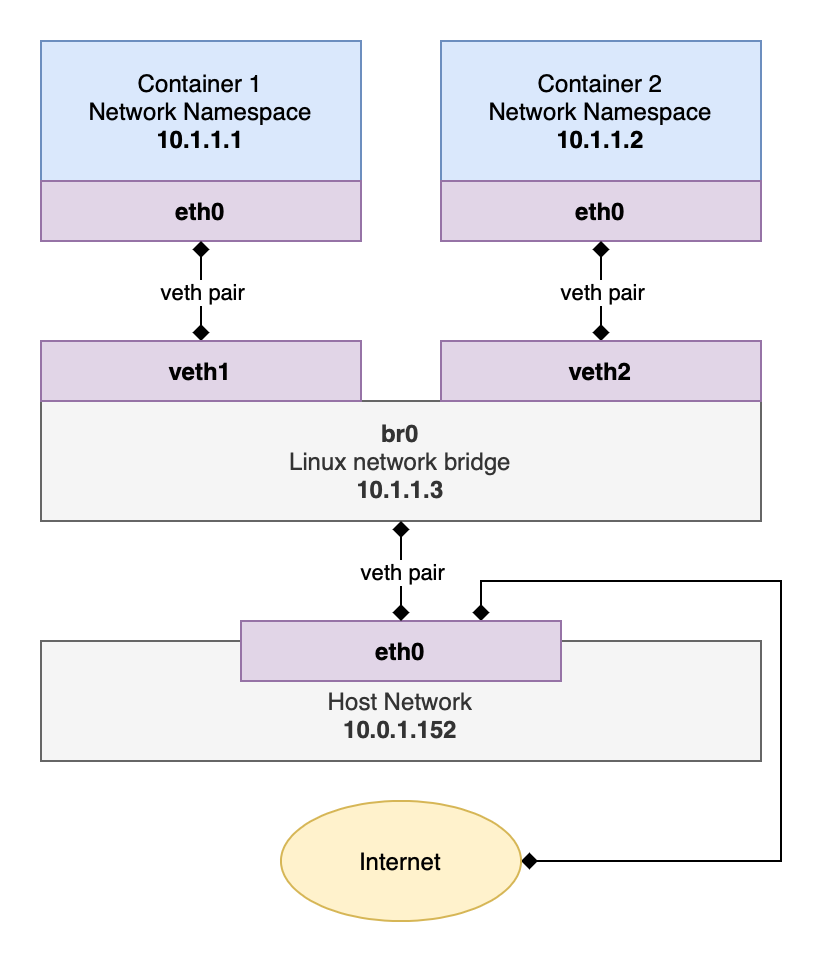

*For the GitHub repo of Dokrust, visit [**here**](https://github.com/lishpr/dokrust).*

This is the second week of Dokrust development. This week I focused on network support. And I successfully connected Dokrust containers to the internet.


## Feature addition

### Networking

Yes, Dokrust now have network support. It is achieved through network namespace, details could be found [here](./2021-01-19-Adding-network-to-a-container.md).

In a nutshell, I did the following:

<center>

</center>

For now, you'll have to launch the container first, then run Dokrust again with the hostname of the container channelled into the ```-k``` option to make it work. The ```-k``` option will only work as a standalone function for now.

<br />

## Next up

### The network module

Now, the network module is still very amateurishly written with directly-invoked shell commands from the Rust code. I plan to refractor the module with the ip-command crate. 

It now has to be set after the container is up and running. I shall make it more streamlined through invoking threads.

And, more thought need to be put with regard to multiple containers. For example, IP addresses need to be more dynamically allocated to each container.

The DNS resolution is still being hard-coded into the container. I should make it dynamic, too.

### Other

As the ultimate goal is to run Android apps in the container,